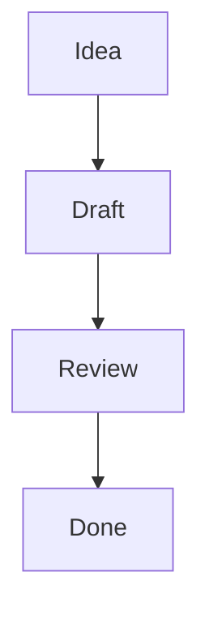

# Manual

## What This Is
This app is a local-first markdown workspace: a folder tree, markdown editor, preview pane, quick search, backlinks, slash-command insertion, and minimal Ollama integration, all served from a Python backend.

## Runtime vs Development
- End users only need Python plus the built backend/runtime files.
- Node.js is only needed when changing the frontend source and rebuilding the static bundle.
- The browser runtime stays offline: frontend assets are served from local files under `app/static/`.

## Setup
### End-user runtime
1. Create and activate a Python virtual environment.
2. Install backend packages with `pip install -r requirements.txt`.
3. Start the server with a chosen workspace root.

### Developer setup
1. Create and activate a Python virtual environment.
2. Install backend packages with `pip install -r requirements.txt`.
3. Install frontend packages with `npm install`.
4. Rebuild the frontend bundle with `npm run build` after frontend changes.

## Run
Start the server with:

```bash
python -m app --root ./workspace
```

Windows PowerShell virtual environment activation:

```powershell
python -m venv .venv
.\.venv\Scripts\Activate.ps1
```

macOS / Linux virtual environment activation:

```bash
python3 -m venv .venv
source .venv/bin/activate
```

Optional flags:
- `--host 127.0.0.1`
- `--port 8000`

Open `http://127.0.0.1:8000` in a browser.

## Root Folder Behavior
- The folder passed to `--root` becomes the managed workspace.
- The app creates `.mdeditor/config.json` there on first run.
- The app also stores database view settings in `.mdeditor/db_views.json`.
- The app remembers the last open note or folder in `.mdeditor/ui_state.json`.
- Uploaded note attachments are stored under `_attachments/` inside the workspace root.
- Only markdown files and folders are shown in the tree.

## Editor UX
- Type `/` at the start of a line to open slash commands.
- `Ctrl+S` or `Cmd+S` triggers an immediate save.
- `Ctrl+K` or `Cmd+K` opens quick note search.
- The folder tree has its own vertical scroll area; the rest of the page keeps the main document/page scroll.
- The `Blocks` panel lets you jump to blocks and move them up or down.
- Heading blocks can be collapsed from the `Blocks` panel to simplify preview focus.
- Typing `[[` starts wiki-link suggestions for existing notes.
- Wiki-links such as `[[Project Notes]]` are clickable in preview.
- The sidebar backlinks panel shows which notes reference the current note.
- The `Menu` popover includes a persisted UI scale slider for larger or smaller text.
- Pane divider widths are remembered per note and per folder; if an item has no saved widths yet, it inherits the current layout once and then keeps its own state.
- Fenced `mermaid` blocks render as diagrams in preview.
- Fenced code blocks with a named language such as `python`, `js`, `ts`, `json`, `bash`, `yaml`, or `sql` render with preview-only syntax highlighting.
- `Save as template` stores the current note content as the default starter template for its folder.
- `Clear template` removes the saved default template for the current note's folder.
- `Attach file` uploads a file into the local workspace and inserts a markdown link at the current cursor.
- Pasting an image/file from the clipboard into the editor uploads it and inserts the markdown link automatically.
- Dragging a file into the editor does the same upload-and-insert flow.
- Image uploads are inserted as ``; other files are inserted as `[name](...)`.
- Rendered attachments such as images are constrained to the preview pane width.

## Folder Database View
- Click a folder in the tree to switch from note editing into a database view for that folder.
- The table reads YAML-style frontmatter from markdown files directly inside that folder.
- Preferred fields are `status`, `tags`, `due`, and `owner`, but any frontmatter keys will appear as columns.
- Use the filter box to narrow the table by title or field values.
- Click any column header to sort ascending or descending.
- Use `Table` and `Board` to switch between a sortable table and status-grouped board columns.
- View mode, filter, sort, status options, and visible columns are remembered per folder in app metadata.
- Each folder can now store multiple named database views.
- Use the view picker to switch between saved views for the current folder.
- `Save as new view` stores the current database configuration as another named view.
- `Rename view` changes the current view name.
- `Delete view` removes the current view, except for the default view.
- Edit metadata inline in the table; changes save back into the note frontmatter on blur.
- In board mode, notes are grouped by `status`, and changing a card's status moves it between columns after save.
- The `Status options` field lets you define the board/select values for that folder, for example `queued, doing, done`.
- Use the visible-column toggles to hide fields you do not want in the table or board card metadata.
- `status` uses a dropdown, `due` uses a date input, `created` and `updated` use datetime inputs in table view, and `tags` remain comma-separated text that saves back as a YAML list.
- Fields such as `relation`, `relations`, `related`, `link`, or `links` are treated as note-reference fields.
- Relation fields accept comma-separated note names and save back as YAML lists.
- Relation chips in the database are clickable and open the referenced note when it exists in the workspace.
- Missing relation targets can be created directly from the relation field.
- Use `New Note` inside the database pane to create a note with starter frontmatter directly in that folder; its default `status` uses the first status option for that folder.
- New notes use the saved folder template when one exists; otherwise the app falls back to the default markdown starter content.
- For `tags`, enter a comma-separated list and it will be written back as a YAML-style array.
- Click a row title or board card title to open the note in the editor.

## Automatic Metadata
- On save, the backend can add or maintain `title`, `created`, and `updated` frontmatter.
- `title` is auto-filled when missing, using the same first-heading / first-content-line logic used for note summaries.
- `created` is set once when the note first gains this metadata.
- `updated` is refreshed on normal saves.
- If you edit `updated` directly from the database table, that explicit value is preserved instead of being immediately overwritten.
- Exported timestamp formats like `2025-09-23 20:45:54Z` are accepted by the database table editor.

Example:

```md
---
status: active
tags:
  - app
  - ui
due: 2026-03-25
owner: andrei
---

# Roadmap
```

Mermaid example:

````md

````

## Offline Guarantee
- No CDN or remote frontend assets are used at runtime.
- The app serves the built frontend bundle from local files.
- Ollama integration targets a local Ollama instance; if it is unavailable, the app still works without AI features.

## Distribution Notes
- If you are shipping to end users, include:
  - `app/`
  - `requirements.txt`
  - `docs/`
- The runtime-served frontend bundle lives in `app/static/`; end users do not need Node.js if this bundle is already built.
- For source-only frontend development, also keep:
  - `frontend/`
  - `package.json`
  - `package-lock.json`
  - `vite.config.js`
- End users do not need `node_modules/` or the frontend source tree if `app/static/` is already built.

## Cross-Platform Notes
- Windows, macOS, and Linux are all supported as long as Python 3.11+ is available.
- Use `python3` instead of `python` on systems where that is the default Python 3 command.
- `npm install`, `npm run test`, and `npm run build` are shell-neutral and work across Windows, macOS, and Linux when Node.js is installed.

## Ollama
- Default endpoint: `http://127.0.0.1:11434`
- Default model: `llama3.2`
- Use the toolbar inputs to update endpoint/model.
- Use `Check Ollama` to verify connectivity.
- `Summarize` sends the current note as a minimal prompt to the configured local model.
